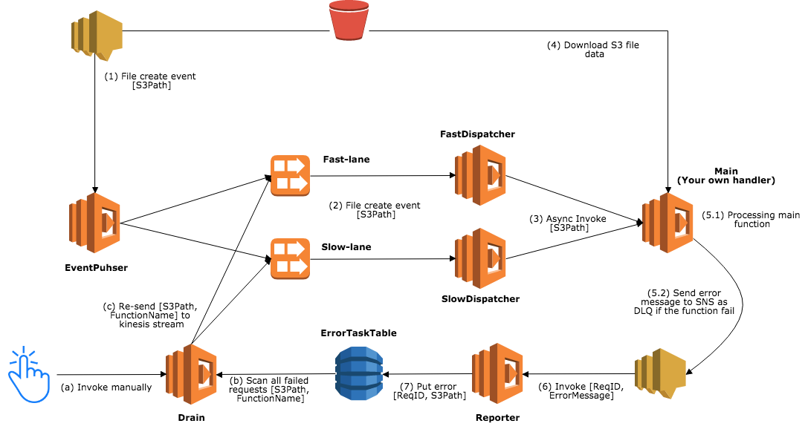

SLIPS: Serverless Log Iterative Processor from S3 
=================

`slips` is framework to process log files that is put into S3 bucket.

Prerequisite
------------

- Python >= 3.6
- AWS credential with permissions to create CloudFormation Stack
- S3 bucket(s)
    - Bucket(s) must send notification of ObjectCreated to SNS. See details in [official document](https://docs.aws.amazon.com/AmazonS3/latest/dev/ways-to-add-notification-config-to-bucket.html).


Setup SLIPS in your project
------------

In your project directory, setup SLIPS by following commands.

```bash
$ virtualenv venv
$ source venv/bin/activate
$ pipenv install -e 'git+ssh://git@ghe.ckpd.co/mizutani/slips.git#egg=slips'
```

And write your meta config file, and save it as `your_config.yml`

```yaml
stack_name: sample-stack
description: this is my app
base:
  sam:
    code_bucket: mizutani-test
    code_prefix: functions

backend:
  role_arn:
    event_pusher: arn:aws:iam::1234xxxxxx:role/LambdaMizutaniSlamEventPusher
    dispatcher:   arn:aws:iam::1234xxxxxx:role/LambdaMizutaniSlamDispatcher
    reporter:     arn:aws:iam::1234xxxxxx:role/LambdaMizutaniSlamReporter
    drain:        arn:aws:iam::1234xxxxxx:role/LambdaMizutaniSlamDrain
  sns_topics:
    - name: SecLogUplaod
      arn: arn:aws:sns:ap-northeast-1:1234xxxxxx:seclog-event

handler:
  role_arn: arn:aws:iam::1234xxxxxx:role/LambdaMizutaniSlamMain
  path: src/handler.py
  args:
    your_key1: value1
    your_key2: value2

routing:
  - bucket: mizutani-test
    prefix: slam2/azure_ad/signinEvents/
    dest: fast
  - bucket: mizutani-test
    prefix: slam2/g_suite/
    dest: fast
  - dest: drop

bucket_mapping:
  mizutani-test:
    - prefix: slam2/azure_ad/signinEvents/
      format: [s3-lines, json, azure-ad-event]
    - prefix: slam2/g_suite/
      format: [s3-lines, json, g-suite-login]
```

Deploy
---------------

```bash
$ slips deploy your_config.yml
```

NOTE: You should have AWS credential with deploy command such as environment variable `AWS_ACCESS_KEY_ID` and `AWS_SECRET_ACCESS_KEY`.

Then creating a CloudFormation stack `sample-stack-***` like a following figure.




Test for only SLIPS
--------------

```bash
$ git clone git@ghe.ckpd.co:mizutani/slips.git
$ cd slips
$ python setup.py test
```
